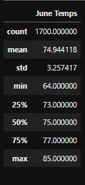
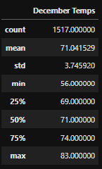

# Surfs_up

## Overview of the statistical analysis
Insight into the weather patterns of a specific location on Oahu where you would like to build your ice cream and surf shop. The analysis looks into tempretures for the months of june and december, it will describe the following:

1. count 
2. mean
3. std
4. min
5. 25%
6. 50%
7. 75%
8. max 

## Results

1. Summary Resultas for June                             

    

2. Summary Resultas for December

## Summary 
We can see that the mean tempreture for june and december are not as hot for ice cream but not to cold to surf. From the max tempreture of june there is a high posibility to sell ice cream and people going surfing, from the min we can determing that no one is likely to buy ice cream or go sufrfing. For the max on december there is a slight chance to go surfing but no si much to buy ice cream, from the min we can determin that we shop should be closed to not waste mooney. 

Two query to make for the month of june and december would be:
1. Does it rain
2. Speed of wind 